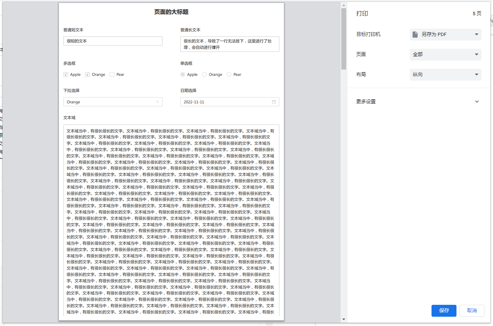
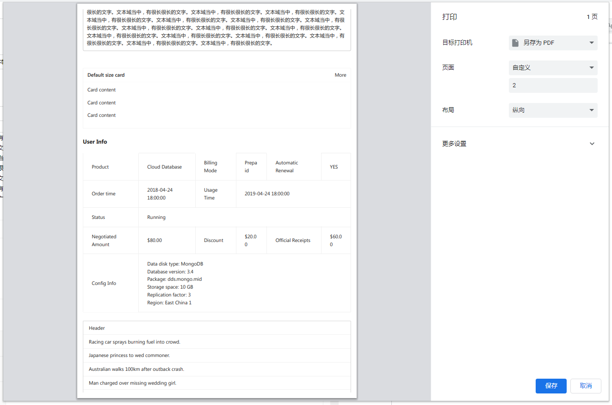
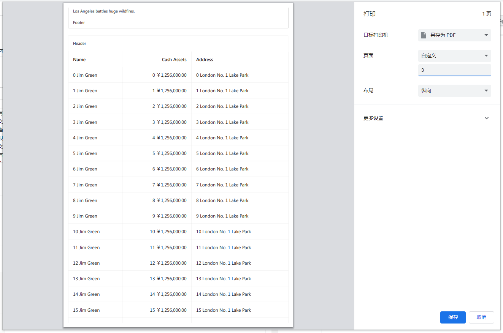
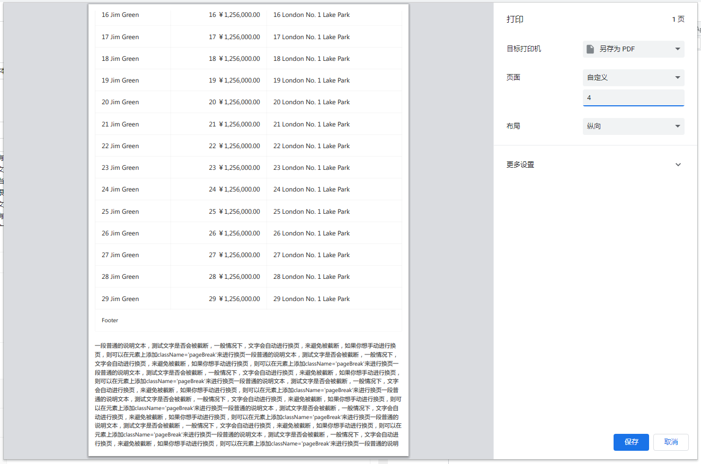
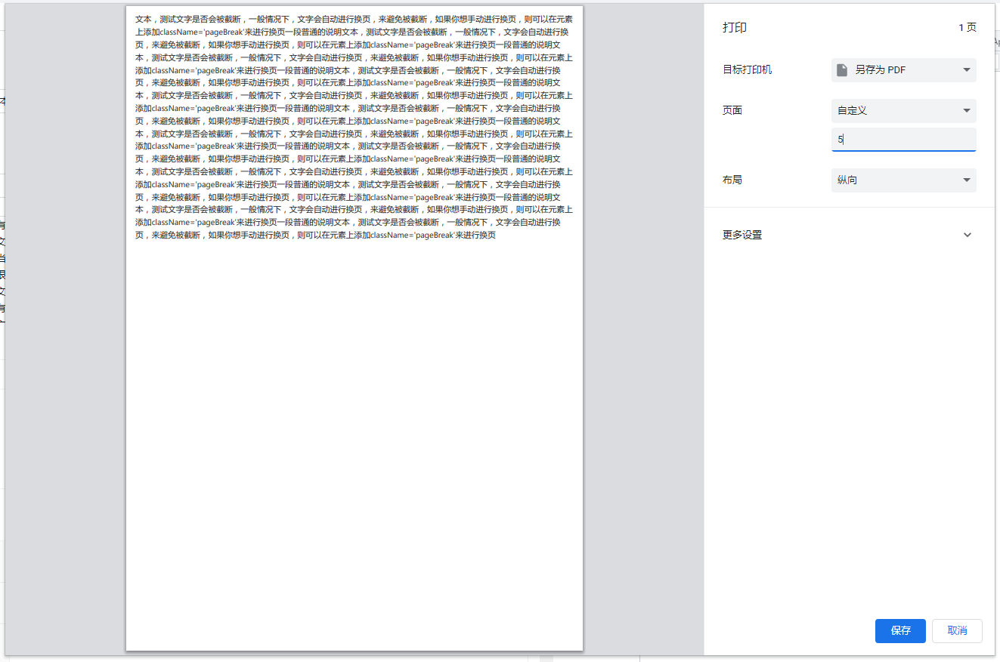

# useWindowPrint 自定义的打印HOOK

## 1 介绍
`useWindowPrint` 用于实现页面的打印，打印的效果相对来说比较好。`useWindowPrint` 支持 `onBeforePrint`、`onBeforePrintContent`、`onAfterPrint` 等回调，可以很方便地在不同阶段进行操作，如果觉得使用回调函数比较麻烦，`useWindowPrint` 也维护了一个 `State`，可以在打印时动态显示和隐藏页面上的元素。

`useWindowPrint` 也支持设置纸张四个方向的边距、页面的缩放比例（Chrome、IE支持，火狐不支持），可以使得打印的效果更为美观。

`useWindowPrint` 底层调用的是 `window.print` 方法，支持全部的浏览器，兼容性比较好。

## 2 打印的相关技术选型
- [react-to-print](https://www.npmjs.com/package/react-to-print)
  - 是一个用于React项目当中的第三方打印库
  - 优点：
    - 支持 `onBeforePrint`、`onBeforeGetContent`、`onAfterPrint` 等回调函数
    - 样式的支持度比较好，打印出来样式的还原度比较高
  - 遇到的问题：
    - 偶发性问题，内容很长导致了换页时，文字有可能会被截断，一个字和上下在两张纸上面
    - 偶发性问题，打印时，Antd的表头出现了多个，导致了与表格内容重叠，不太清楚是不是项目当中其他的样式影响，导致了双表头重叠
    - 项目当中的某个机器上不支持，兼容性可以根据自身项目的实际情况进行考虑

- [print-js](https://www.npmjs.com/package/print-js)
  - 是一个PC端的打印库，各种框架都是支持的
  - 优点：
    - 支持打印HTML元素、图片、JSON数据等
  - 遇到的问题：
    - 没有相关的打印回调
    - 样式支持度不高，复杂页面、复杂布局的打印效果不理想

- [window.print](https://developer.mozilla.org/zh-CN/docs/Web/API/Window/print)
  - 是JavaScript原生自带的浏览器方法
  - 优点：
    - 支持全部的浏览器，兼容性比较好
    - 自由度比较高，可以根据自己的需求进行封装
    - 样式可以自定义，效果相对来说比较理想
  - 遇到的问题：
    - 直接调用时，只能打印当前可视窗口内的内容，无法打印完全（通过iframe的方式解决了此问题）

## 3 useWindowPrint 使用示例
```js
// 自定义HOOK
const [isPrint, beginPrint] = useWindowPrint({
  contentId: "PrintDemoId",
  margin: "5mm", // 打印的边距
  zoom: 1, // 打印时的缩放比例，仅支持chrome和IE，火狐不支持
  // 打印之前的回调，可以处理State
  onBeforePrint: () => new Promise((resolve) => {
    resolve();
  }),
  // 打印DOM结构之前的回调，可以处理打印时DOM结构
  onBeforePrintContent: (pageDomClone, iframe) => new Promise((resolve) => {
    console.log(pageDomClone, iframe);
    resolve();
  }),
  // 打印完成之后的回调
  onAfterPrint: () => new Promise((resolve) => {
    resolve();
  }),
});

// 打印
const handlePrint = () => {
  beginPrint();
};
```

## 4 useWindowPrint 打印效果预览

<div style="display: flex; justify-content: space-between">
  
  
  
</div>
<br />
<div style="display: flex;">
  
  
</div>

## 5 useWindowPrint 主要封装思想
- 点击打印按钮，调用 `beginPrint` 方法，在此方法中更改 `isPrint` 为 `true`
- `useEffect` 当中监听 `isPrint`，为`true`时，则进行打印操作
- 创建一个 `iframe`，修改定位，使其不显示在页面上，指定其 `onload` 事件， `onload` 事件当中执行以下操作：
  - 根据传递进来的id，获取页面上的 `DOM` 结构：`pageDom`
  - 复制此 `DOM` 结构，得到复制过后的 `DOM` 结构：`pageDomClone`
  - 将Antd样式文件、公共打印样式文件添加到 `iframe` 的head标签当中，处理纸张边距和缩放比例
  - 处理部分Antd组件打印异常的问题
  - 将处理完成的 `DOM`，添加到 `iframe` 当中
  - 延时调用打印，防止样式不生效
  - 调用完 `window.print` 之后，执行打印完成的回调
- 将 `iframe` 添加到 `document.body` 当中

## 6 useWindowPrint 源码和示例代码
- `useWindowPrint.js：` src\hooks\useWindowPrint.js
- `PrintDemo.jsx：` src\views\PrintDemo.jsx
- `printStyle：` public\printStyle